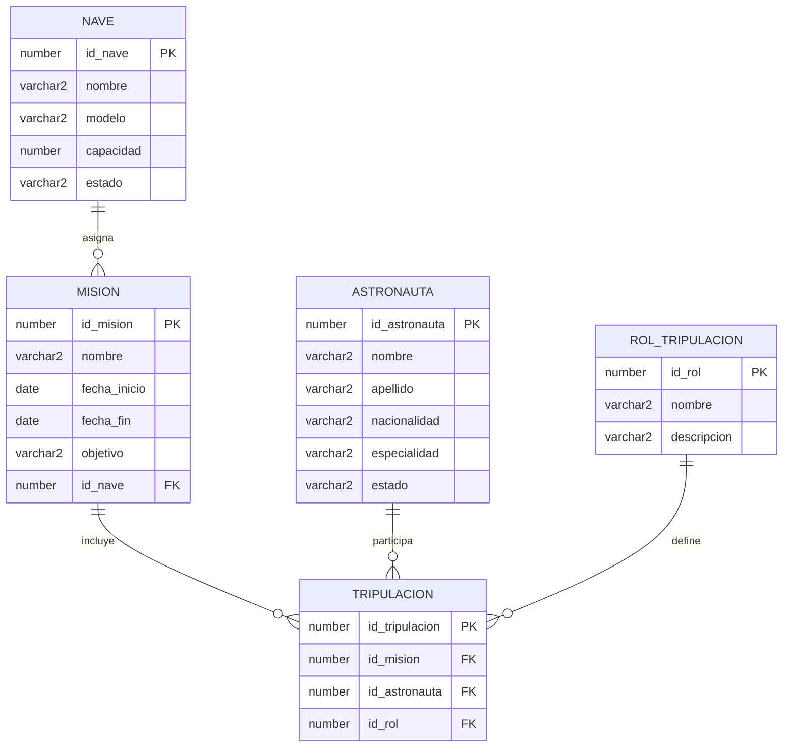

# Prueba Práctica Avanzada Oracle SQL

## Universidad Técnica de Ambato
### Facultad de Ingeniería en Sistemas
### Asignatura: Bases de Datos

---

# Estudiante
Oscar Mauricio Guevara López

# Escenario asignado
Agencia Espacial

# Tipo de integridad
ON DELETE CASCADE

---

# Descripción del proyecto

Este proyecto corresponde al desarrollo de la prueba práctica avanzada de Oracle SQL.

El sistema modela una Agencia Espacial mediante entidades relacionadas con misiones espaciales, astronautas, naves y tripulaciones.

Se desarrolló:
- Modelo lógico simplificado
- Scripts DDL
- Scripts DML
- Restricciones de integridad
- Consultas SQL
- Evidencias manuales
- Evidencias de Oracle

---

# Objetivo

Diseñar e implementar una base de datos relacional aplicando restricciones de integridad, consultas SQL y relaciones entre tablas utilizando Oracle SQL.

---

# Justificación del modelo lógico simplificado

Se utilizó un modelo lógico simplificado porque permite representar de forma clara las relaciones principales del sistema espacial sin agregar complejidad innecesaria.

Las entidades seleccionadas permiten controlar:
- Las misiones espaciales
- Los astronautas participantes
- Las naves utilizadas
- Los roles de cada tripulante

La tabla TRIPULACION se implementó como tabla intermedia para resolver la relación muchos a muchos entre MISION y ASTRONAUTA.

Este diseño mejora:
- La organización de datos
- La integridad referencial
- La escalabilidad
- La consistencia de la información

---

# Modelo lógico

---

# Explicación de tablas

## NAVE
Almacena información de las naves espaciales utilizadas en las misiones.

## MISION
Contiene los datos principales de cada misión espacial.

## ASTRONAUTA
Guarda la información personal y especialidad de los astronautas.

## ROL_TRIPULACION
Define los roles que puede tener un astronauta dentro de una misión.

## TRIPULACION
Relaciona astronautas con misiones y roles específicos.

---

# Integridad referencial

Se implementaron claves primarias y foráneas para garantizar consistencia entre tablas.

También se aplicaron:
- NOT NULL
- UNIQUE
- CHECK
- FOREIGN KEY

---

# Uso de ON DELETE CASCADE

Se utilizó ON DELETE CASCADE para que, al eliminar un registro padre, Oracle elimine automáticamente los registros hijos relacionados.

Esto evita inconsistencias y mantiene la integridad de los datos.

Ejemplo:
Si se elimina una misión, también se eliminan automáticamente los registros relacionados en TRIPULACION.

---

# Explicación del error ORA-02291

El error ORA-02291 ocurre cuando se intenta insertar un registro hijo sin que exista previamente el registro padre relacionado.

En este proyecto se provocó el error al intentar insertar una misión con un id_nave inexistente.

---

# Evidencias

## Desarrollo manual

### Modelo lógico

### Script DDL

### Script DML

### Consultas SQL

### ANÁLISIS PROFESIONAL

---

# Conclusiones

- Oracle SQL permite manejar integridad referencial de forma segura.
- El uso de ON DELETE CASCADE facilita el mantenimiento de relaciones entre tablas.
- Las restricciones ayudan a evitar inconsistencias en la base de datos.
- El modelo lógico simplificado permite una representación clara del sistema.
