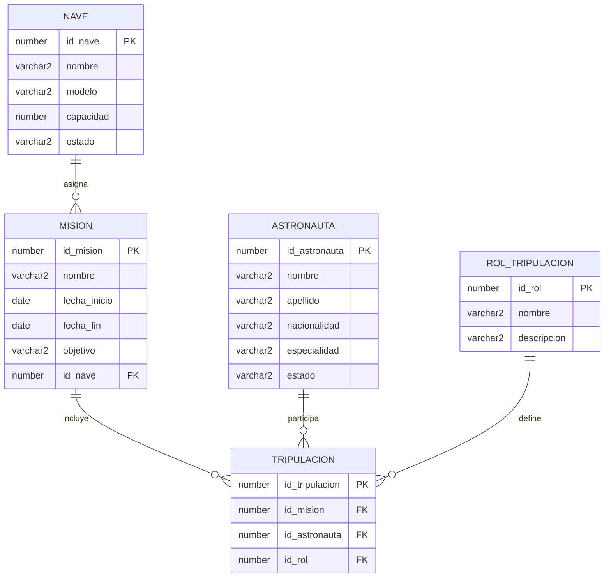
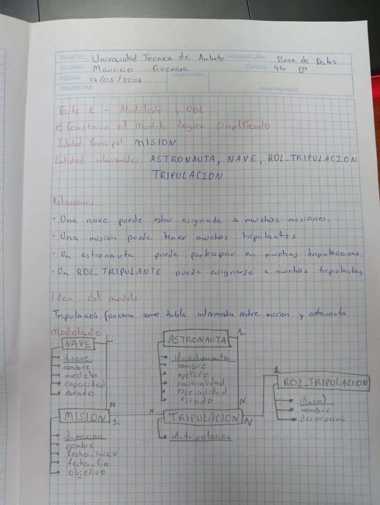
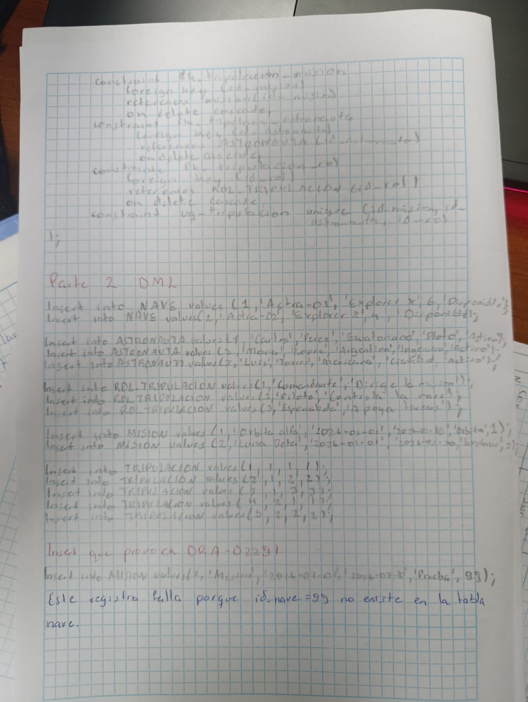
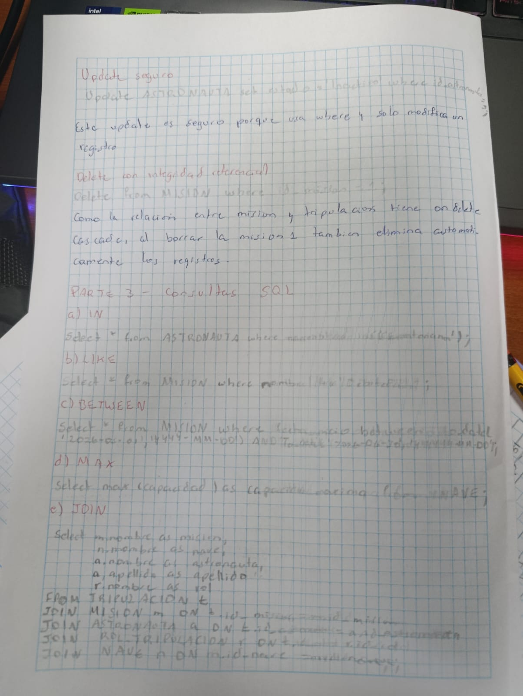
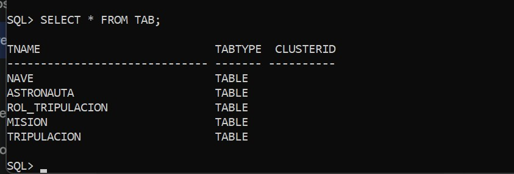
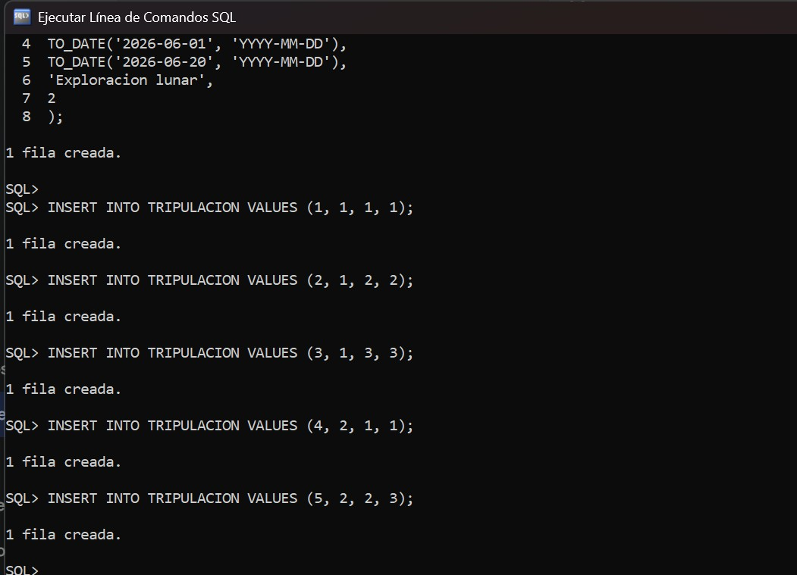
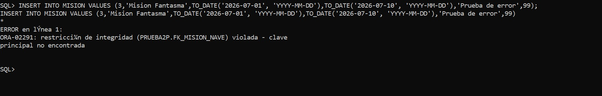
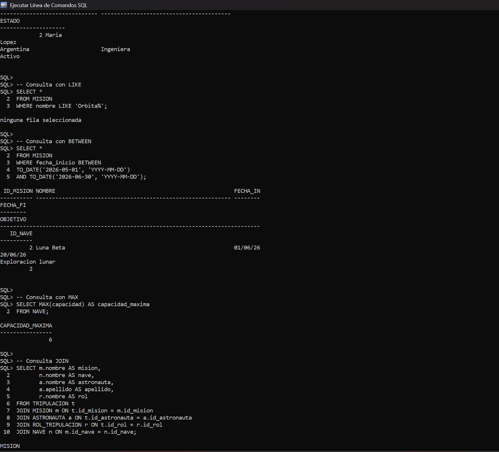

# Prueba Práctica Avanzada Oracle SQL

## Universidad Técnica de Ambato
### Facultad de Ingeniería en Sistemas
### Asignatura: Bases de Datos

---

# Estudiante
Oscar Mauricio Guevara López

# Escenario asignado
Agencia Espacial

# Tipo de integridad
ON DELETE CASCADE

---

# Descripción del proyecto

Este proyecto corresponde al desarrollo de la prueba práctica avanzada de Oracle SQL.

El sistema modela una Agencia Espacial mediante entidades relacionadas con misiones espaciales, astronautas, naves y tripulaciones.

Se desarrolló:
- Modelo lógico simplificado
- Scripts DDL
- Scripts DML
- Restricciones de integridad
- Consultas SQL
- Evidencias manuales
- Evidencias de Oracle

---

# Objetivo

Diseñar e implementar una base de datos relacional aplicando restricciones de integridad, consultas SQL y relaciones entre tablas utilizando Oracle SQL.

---

# Justificación del modelo lógico simplificado

Se utilizó un modelo lógico simplificado porque permite representar de forma clara las relaciones principales del sistema espacial sin agregar complejidad innecesaria.

Las entidades seleccionadas permiten controlar:
- Las misiones espaciales
- Los astronautas participantes
- Las naves utilizadas
- Los roles de cada tripulante

La tabla TRIPULACION se implementó como tabla intermedia para resolver la relación muchos a muchos entre MISION y ASTRONAUTA.

Este diseño mejora:
- La organización de datos
- La integridad referencial
- La escalabilidad
- La consistencia de la información

---

# Modelo lógico



---

# Explicación de tablas

## NAVE
Almacena información de las naves espaciales utilizadas en las misiones.

## MISION
Contiene los datos principales de cada misión espacial.

## ASTRONAUTA
Guarda la información personal y especialidad de los astronautas.

## ROL_TRIPULACION
Define los roles que puede tener un astronauta dentro de una misión.

## TRIPULACION
Relaciona astronautas con misiones y roles específicos.

---

# Integridad referencial

Se implementaron claves primarias y foráneas para garantizar consistencia entre tablas.

También se aplicaron:
- NOT NULL
- UNIQUE
- CHECK
- FOREIGN KEY

---

# Uso de ON DELETE CASCADE

Se utilizó ON DELETE CASCADE para que, al eliminar un registro padre, Oracle elimine automáticamente los registros hijos relacionados.

Esto evita inconsistencias y mantiene la integridad de los datos.

Ejemplo:
Si se elimina una misión, también se eliminan automáticamente los registros relacionados en TRIPULACION.

---

# Explicación del error ORA-02291

El error ORA-02291 ocurre cuando se intenta insertar un registro hijo sin que exista previamente el registro padre relacionado.

En este proyecto se provocó el error al intentar insertar una misión con un id_nave inexistente.

---

# Scripts SQL

## Script DDL

El siguiente script DDL fue desarrollado para crear la estructura completa de la base de datos del sistema Agencia Espacial.

Se implementaron:
- PRIMARY KEY
- FOREIGN KEY
- NOT NULL
- UNIQUE
- CHECK
- ON DELETE CASCADE

```sql
CREATE TABLE NAVE (
    id_nave NUMBER PRIMARY KEY,
    nombre VARCHAR2(50) NOT NULL UNIQUE,
    modelo VARCHAR2(50) NOT NULL,
    capacidad NUMBER NOT NULL,
    estado VARCHAR2(20) NOT NULL,
    CONSTRAINT chk_nave_capacidad CHECK (capacidad > 0),
    CONSTRAINT chk_nave_estado CHECK (estado IN ('Disponible', 'Mision', 'Mantenimiento'))
);

CREATE TABLE ASTRONAUTA (
    id_astronauta NUMBER PRIMARY KEY,
    nombre VARCHAR2(50) NOT NULL,
    apellido VARCHAR2(50) NOT NULL,
    nacionalidad VARCHAR2(30) NOT NULL,
    especialidad VARCHAR2(40) NOT NULL,
    estado VARCHAR2(20) NOT NULL,
    CONSTRAINT chk_astronauta_estado CHECK (estado IN ('Activo', 'Inactivo'))
);

CREATE TABLE ROL_TRIPULACION (
    id_rol NUMBER PRIMARY KEY,
    nombre VARCHAR2(30) NOT NULL UNIQUE,
    descripcion VARCHAR2(100) NOT NULL
);

CREATE TABLE MISION (
    id_mision NUMBER PRIMARY KEY,
    nombre VARCHAR2(60) NOT NULL UNIQUE,
    fecha_inicio DATE NOT NULL,
    fecha_fin DATE NOT NULL,
    objetivo VARCHAR2(120) NOT NULL,
    id_nave NUMBER NOT NULL,
    CONSTRAINT chk_mision_fechas CHECK (fecha_fin >= fecha_inicio),
    CONSTRAINT fk_mision_nave
        FOREIGN KEY (id_nave)
        REFERENCES NAVE(id_nave)
        ON DELETE CASCADE
);

CREATE TABLE TRIPULACION (
    id_tripulacion NUMBER PRIMARY KEY,
    id_mision NUMBER NOT NULL,
    id_astronauta NUMBER NOT NULL,
    id_rol NUMBER NOT NULL,
    CONSTRAINT fk_tripulacion_mision
        FOREIGN KEY (id_mision)
        REFERENCES MISION(id_mision)
        ON DELETE CASCADE,
    CONSTRAINT fk_tripulacion_astronauta
        FOREIGN KEY (id_astronauta)
        REFERENCES ASTRONAUTA(id_astronauta)
        ON DELETE CASCADE,
    CONSTRAINT fk_tripulacion_rol
        FOREIGN KEY (id_rol)
        REFERENCES ROL_TRIPULACION(id_rol)
        ON DELETE CASCADE,
    CONSTRAINT uq_tripulacion UNIQUE (id_mision, id_astronauta, id_rol)
);
```

---

## Script DML

El siguiente script DML contiene registros válidos para probar el funcionamiento de la base de datos.

También se incluyen ejemplos de:
- INSERT válidos
- UPDATE seguro
- DELETE con integridad referencial
- Error ORA-02291

```sql
INSERT INTO NAVE VALUES (1, 'Astra-01', 'Explorer X', 6, 'Disponible');
INSERT INTO NAVE VALUES (2, 'Astra-02', 'Explorer Z', 4, 'Disponible');

INSERT INTO ASTRONAUTA VALUES (1, 'Carlos', 'Perez', 'Ecuatoriana', 'Piloto', 'Activo');
INSERT INTO ASTRONAUTA VALUES (2, 'Maria', 'Lopez', 'Argentina', 'Ingeniera', 'Activo');
INSERT INTO ASTRONAUTA VALUES (3, 'Luis', 'Torres', 'Mexicana', 'Cientifico', 'Activo');

INSERT INTO ROL_TRIPULACION VALUES (1, 'Comandante', 'Dirige la mision');
INSERT INTO ROL_TRIPULACION VALUES (2, 'Piloto', 'Controla la nave');
INSERT INTO ROL_TRIPULACION VALUES (3, 'Especialista', 'Apoya tareas tecnicas');

INSERT INTO MISION VALUES (
1,
'Orbita Alfa',
TO_DATE('2026-05-01', 'YYYY-MM-DD'),
TO_DATE('2026-05-15', 'YYYY-MM-DD'),
'Estudio de la orbita terrestre',
1
);

INSERT INTO MISION VALUES (
2,
'Luna Beta',
TO_DATE('2026-06-01', 'YYYY-MM-DD'),
TO_DATE('2026-06-20', 'YYYY-MM-DD'),
'Exploracion lunar',
2
);

INSERT INTO TRIPULACION VALUES (1, 1, 1, 1);
INSERT INTO TRIPULACION VALUES (2, 1, 2, 2);
INSERT INTO TRIPULACION VALUES (3, 1, 3, 3);
INSERT INTO TRIPULACION VALUES (4, 2, 1, 1);
INSERT INTO TRIPULACION VALUES (5, 2, 2, 3);

UPDATE ASTRONAUTA
SET estado = 'Inactivo'
WHERE id_astronauta = 3;

DELETE FROM MISION
WHERE id_mision = 1;

INSERT INTO MISION VALUES (
3,
'Mision Fantasma',
TO_DATE('2026-07-01', 'YYYY-MM-DD'),
TO_DATE('2026-07-10', 'YYYY-MM-DD'),
'Prueba de error',
99
);
```

---

## Script de Consultas SQL

Las siguientes consultas fueron desarrolladas para demostrar el uso de diferentes operadores y funciones SQL.

```sql
-- Consulta con IN
SELECT *
FROM ASTRONAUTA
WHERE nacionalidad IN ('Ecuatoriana', 'Argentina');

-- Consulta con LIKE
SELECT *
FROM MISION
WHERE nombre LIKE 'Orbita%';

-- Consulta con BETWEEN
SELECT *
FROM MISION
WHERE fecha_inicio BETWEEN
TO_DATE('2026-05-01', 'YYYY-MM-DD')
AND TO_DATE('2026-06-30', 'YYYY-MM-DD');

-- Consulta con MAX
SELECT MAX(capacidad) AS capacidad_maxima
FROM NAVE;

-- Consulta JOIN
SELECT m.nombre AS mision,
       n.nombre AS nave,
       a.nombre AS astronauta,
       a.apellido AS apellido,
       r.nombre AS rol
FROM TRIPULACION t
JOIN MISION m ON t.id_mision = m.id_mision
JOIN ASTRONAUTA a ON t.id_astronauta = a.id_astronauta
JOIN ROL_TRIPULACION r ON t.id_rol = r.id_rol
JOIN NAVE n ON m.id_nave = n.id_nave;
```
---

# Evidencias

## Desarrollo manual

### Modelo lógico


### Script DDL


### Script DML


### Consultas SQL


### ANÁLISIS PROFESIONAL


---

# Capturas Oracle SQL

## Creación de tablas


## Inserción de registros


## Error ORA-02291


## Consultas SQL ejecutadas


---


# Conclusiones

- Oracle SQL permite manejar integridad referencial de forma segura.
- El uso de ON DELETE CASCADE facilita el mantenimiento de relaciones entre tablas.
- Las restricciones ayudan a evitar inconsistencias en la base de datos.
- El modelo lógico simplificado permite una representación clara del sistema.
